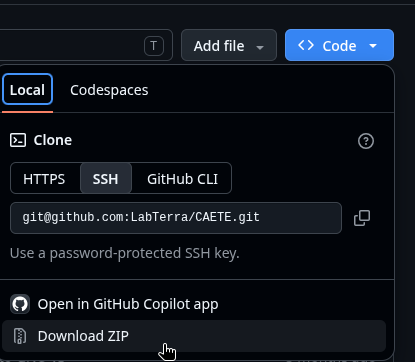

# CAETÊ

## Run CAETÊ using docker

### 1. Install Docker

- Mac/Windows: [Docker Desktop](https://docs.docker.com/desktop/)
- Linux: [Docker Engine](https://docs.docker.com/engine/install/)

Checking if docker was was correclty installed:
1) Open terminal and type command `docker`;
2) Open terminal and type command `docker-compose`;
3) Open terminal and type command `docker run hello-world`;

!!! warning "Warning"
    In case you installed docker on Linux and you are receiving errors when trying to run without sudo, please follow the entire tutorial above. It includes following [Linux postinstall instructions](https://docs.docker.com/engine/install/linux-postinstall)

### 2. (OPTIONAL) Install VSCode - Install in case you want to open CAETÊ source code

To install VSCode, please download it and install using the following link: https://code.visualstudio.com/download

### 3. (OPTIONAL) Install Git - Install it in case you want to clone CAETÊ repository from Github

Before install, check if git is already installed. To do this, please open a terminal and type the command `git`. In case you need to install git, please follow the instructions on https://git-scm.com/install/

To check if git was correclty installed, please open terminal and type command `git`.

### 4. Run CAETÊ using docker

**4.1)** Open this branch's URL (https://github.com/LabTerra/CAETE/tree/lu-docker) and download CAETÊ source code ZIP from Github (Figure below)



**4.2)** Extract the ZIP file inside a folder you prefer in your computer;

**4.3)** Open a terminal inside this CAETÊ repository folder;

**4.4)** Run a command from below list:

- **CAETE-BASH:** The following command opens the bash inside container (CAETÊ folder). Use this command to run any CAETÊ command mannualy, such as `make so`, `python model_driver.py`, etc:
    `docker compose run caete-bash`
- **CAETE-RUN:** The following command compiles and runs CAETÊ with interactive arguments (default):
    `docker compose run caete-run`
- **CAETE-RUN without interactive arguments:** The following command compiles and runs CAETÊ without interactive arguments. It means you can set the CAETÊ input interactive arguments on command line:
    - **Locally:**
        `PLS=1000 MASK=a VERSION=1 SOMBRERO=n OUTPUT_NAME=test ZONE=c docker compose run caete-run`
    - **Sombrero:**
        `PLS=1000 MASK=a VERSION=1 SOMBRERO=y CLIMATOLOGY=5 docker compose run caete-run`

## WARNING: README NOT REVISED FROM HERE

## Running and Developing CAETÊ

This section suposses you have a working python environment and an installed fortran compiler. I strongly recommend you to do it in a LINUX/GNU operating system. Most of the fuctionality will not work on MS-windows systems because of the parallel computations realized in python.
If you are a MAC-OS user and need help to set up your environment, check the [development environment section](#development-Environment)

CAETÊ uses both Python and Fortran and uses `f2py` module to create an library of code (functions and subroutines) that can be imported and used in python scripts. This means that the Fortran code must be compiled before you can run the code.

The Makefile inside `/src` folder have useful automation to make it easier.

`clean_plsgen` - remove the cache files containing allocation combinations for PLS creation in plsgen.py. Run this will make the first run of CAETÊ in your computer slower but will make sure that your input data is ok!

`make clean` - it clear your python cache and deletes some compiled files.

`make so` - compile fortran source and creates a file named with something like `caete_module.so`, the wrapped Fortran functions and subroutines for python.

For your use we prepared some sampled input data. You probably do not want to run the model for the entire Amazon outside an HPC environment and we are not able to publicize the input dataset.

To build and run CAETÊ in you PC you can do the following:

```bash
# Use pyenv to select your python executable
CAETE-DVM$ pyenv local <define your python version (>= 3.5)

# Goto the source file
CAETE-DVM$ cd src

# Clean you cache
CAETE-DVM/src$ make clean_plsgen
# After the first clean_plsgen there is almost no need to run in anymore.
# If you change the plsgen.py file, particularly the creation
# of allocation combinations you must to re-run the above command

CAETE-DVM/src$ make clean

# Build caete_module.so
CAETE-DVM/src$ make so

# Run the model, -i will leave you in the python shell that executed model_driver.py
CAETE-DVM/src$ python -i model_driver.py

# At this point the model will ask you if it will run in sombrero
# Just say: n<enter>
# Choose the region you want to execute and wait a time.
```

We have a module that stores the data of the compressed binary model outputs in netCDF (CF compliant) files. It runs right after the model calculations are ended.
So you have two types of output data:

1 - The results are saved as compressed pickled python dictionaries for each gridcell for each each spinup realized by the `grd.run_caete` method in a numerated file with the extension `.pkz` in the folder `./ouputs/run_name/gridcellYX/spinZ.pkz` where Y and X are the geographic coordinates of the grid cell object, Z is the number of consecutive spinups made by the `grd.run_caete` method and `run_name` is a string asked to be inputed by the user before everthing starts. This is the standard output data when running the model with plot originated data. Time related metadata is saved within each .pkz file.

If you want to check your raw outputs:

```bash

# go to the ouputs folder for a specific grid cell
CAETE-DVM$ cd ouputs/run_name/gridcellYX # where Y & X are the indexes

# open the python interpreter
CAETE-DVM/outputs/run_name/gridcellYX$ python
```

```python

# To open the ouputs and check the file contents
>>> import joblib
>>> # Open the file containing the 5th spinup realized
>>> # edit the functions apply_fun() in model_driver.py script
>>> with open("spin05.pkz", 'rb') as fh:
>>>    dt = joblib.load(fh)
>>> dt.keys() # list the available keys for the ouputs
>>> # PLot some variables
>>> import matplotlib.pyplot as plt
>>> plt.plot(dt['npp'])
>>> plt.show()
>>> plt.plot(dt['area'].T)
>>> plt.show()
>>> plt.plot(dt['u_strat'][0,:,:].T, 'x')
>>> plt.show()

```

2 - In the same folder were the raw outputs are saved (`./ouputs/run_name/`) you will find the nc_outputs folder,_i.e._, the
folder containing CF compliant netCDF files with daily values for the main output variables. Some high dimensional output data is simplified. So, some valuable information is absent in the netCDF files.

## Development Environment

If you need help configuring your development environment, installing python, installing CAETÊ dependencies or setting up a debug enviornment in vscode, check the [CAETÊ starting pack tutorial](https://github.com/fmammoli/CAETE-Tutorials)

## __CONTRIBUTORS__

- Anja Rammig
- Bárbara R. Cardeli
- Bianca Rius
- Caio Fascina
- Carlos A. Quesada
- David Lapola
- Felipe Mammoli
- Gabriela M. Sophia
- Gabriel Marandola
- Helena Alves
- Katrin Fleischer
- Phillip PAPAstefanou
- Tatiana Reichert
