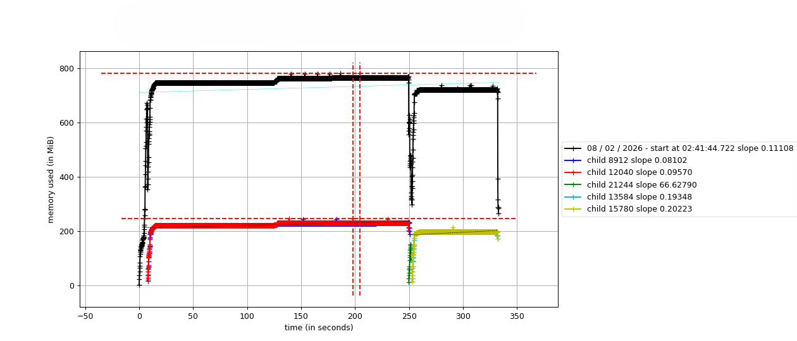
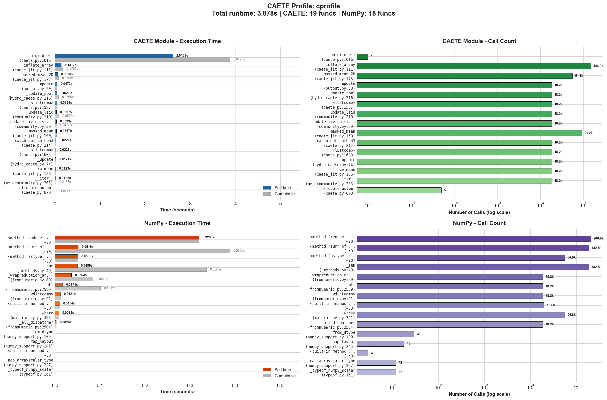

# CAETÊ Profiling Guide

This document describes how to run memory profiling, CPU profiling, and functional tests for the CAETÊ model using the `caete.py` module.

## Prerequisites

Before running profiling, ensure you have **Graphviz** installed on your system:
- **Windows**: Download from [graphviz.org](https://graphviz.org/download/) or `winget install graphviz`
- **Linux**: `sudo apt install graphviz`
- **macOS**: `brew install graphviz`

## Running Modes

The `caete.py` module supports three execution modes when run as a script:

| Mode | Command | Description |
|------|---------|-------------|
| Skip | `python caete.py pass` | Load module only, skip all execution |
| Memory Profiling | `mprof run --multiprocess --include-children caete.py` | Profile memory usage |
| CPU Profiling | `python caete.py cprof` | Profile CPU usage with cProfile |
| Functional Test | `python caete.py` | Run basic functionality tests |

---

## 1. Memory Profiling

Memory profiling uses the `memory_profiler` package to track memory consumption during model execution.

### Setup

1. Set `PROF_M = True` in the header of `caete.py` (around line 161):

```python
PROF_M = True  # Enable memory profiling
```

**WARNING**: If you are not profiling the memory, ```PROF_M``` must be ```False```.

2. Ensure you have the required input data:
   - `../input/MPI-ESM1-2-HR/historical/caete_input_MPI-ESM1-2-HR_historical.nc`
   - `../input/MPI-ESM1-2-HR/ssp370/caete_input_MPI-ESM1-2-HR_ssp370.nc`
   - `../input/co2/historical_CO2_annual_1765-2024.csv`
   - `../input/co2/ssp370_CO2_annual_2015-2100.csv`
   - `../grd/gridlist_profile.csv`
   - `./PLS_MAIN/pls_attrs-5000.csv`

### Running

From the `src/` directory:

```powershell
mprof run --multiprocess --include-children caete.py
```

> **Note:** If you run `python caete.py` directly with `PROF_M = True`, the script will detect this and exit with instructions to use `mprof`.

You can pipe the output of mprof to a text file:

_powershell_ example:

```PowerShell
PS> mprof run --multiprocess caete.py | Tee-Object -FilePath mprof_output.txt
```

_bash_ example:

```bash
$ mprof run --multiprocess --include-children caete.py | tee mprof_output.txt
```

### What it profiles

The memory profiling mode runs a complete model workflow:

1. Creates a region with historical climate data
2. Runs `task1` (spinup + transient run 1901-2014)
3. Updates input data to SSP370 scenario
4. Saves model state (`state1.z`)
5. Runs `task2` (projection run 2015-2050)
6. Cleans and saves final state (`state2.z`)

### Viewing Results

After profiling completes, view the memory usage plot:

```powershell
mprof plot -s
```

The output data is saved in `mprofile_*.dat` files in the current directory.

### Example Output



*Example memory profile showing memory consumption over time during a CAETÊ simulation.*

---

## 2. CPU Profiling (cProfile)

CPU profiling uses Python's built-in `cProfile` module to identify performance bottlenecks.

### Setup

Ensure `PROF_M = False` in `caete.py`:

```python
PROF_M = False  # Disable memory profiling
```

### Running

From the `src/` directory:

```powershell
python caete.py cprof
```

### What it profiles

The CPU profiling mode:

1. Loads test data from `./test_data/`
2. Runs `gridcell.run_gridcell()` for 50 spinup iterations over 1 year (1901)
3. Generates profiling output files

### Output Files

| File | Description |
|------|-------------|
| `cprofile.prof` | Raw cProfile statistics (binary format) |
| `cprofile.dot` | Call graph in DOT format (requires `gprof2dot`) |
| `cprofile.svg` | Visual call graph in SVG vector format (requires Graphviz) |
| `cprofile_profile.png` | Bar chart visualization from `profile_analyzer.py` |

### Console Output

The `profile_analyzer.py` module prints detailed profiling tables to the console:

1. **Top 20 Functions by Cumulative Time** - Functions sorted by total time including all subcalls
2. **Top 20 Functions by Total Time (Self)** - Functions sorted by time spent in the function itself
3. **NumPy-related calls** - All functions involving NumPy operations
4. **Multiprocessing-related calls** - Functions related to parallel processing
5. **CAETE module calls** - All functions from CAETE modules

### Profile Visualization

The `profile_analyzer.py` script generates a 4-panel bar chart (`cprofile_profile.png`):

| Panel | Description |
|-------|-------------|
| **CAETE Module - Execution Time** | Self time (colored) and cumulative time (grey) for CAETE functions |
| **CAETE Module - Call Count** | Number of calls to each CAETE function (log scale if range is large) |
| **NumPy - Execution Time** | Self time and cumulative time for NumPy operations |
| **NumPy - Call Count** | Number of calls to NumPy functions |

The visualization helps identify:
- **Hotspots**: Functions with high self-time are candidates for optimization
- **Frequently called functions**: High call counts may indicate loop inefficiencies
- **Cumulative vs self time**: Large differences suggest time is spent in subcalls



*Example output from profile_analyzer.py showing execution time and call counts for CAETE and NumPy functions.*

### Call Graph Visualization

The `cprofile.svg` file provides a visual call graph showing function relationships and time distribution:


*Call graph generated by gprof2dot and Graphviz. Node colors indicate time spent (red = more time). Arrow thickness indicates call frequency.*

### Viewing Results

**Interactive analysis:**

```python
import pstats
p = pstats.Stats('cprofile.prof')
p.sort_stats('cumulative').print_stats(20)  # Top 20 functions by cumulative time
```

**Visual call graph:**

Open `cprofile.svg` in any web browser or image viewer. The SVG is a vector format suitable for zooming and printing.

**Using snakeviz (alternative):**

```bash
pip install snakeviz
snakeviz cprofile.prof
```

---

## 3. Functional Testing

Functional testing runs the model with test data to verify basic functionality.

### Setup

Ensure `PROF_M = False` in `caete.py`:

```python
PROF_M = False
```

### Running

From the `src/` directory:

```powershell
python caete.py
```

### What it tests

The functional test mode:

1. Loads test data from `./test_data/`:
   - `test_grd.csv` - Test gridlist
   - `pls_attrs-5000.csv` - PLS attributes table
   - `test_input.nc` - Climate input data

2. Creates a region and sets gridcells in memory

3. Runs three model executions:
   - **Run 1**: 1 year spinup without saving (tests `env_filter` and `reset_community`)
   - **Run 2**: 1 year with output saving (tests data serialization)
   - **Run 3**: 1 year after directory and input update (tests configuration changes)

4. Reports total execution time

### Expected Output

```
Run time: XX.XX seconds
```

A successful run indicates the core model functionality is working correctly.

---

## 4. Skip Mode (Interactive Loading)

To load the module without running any tests or profiling (useful for IPython/Jupyter):

```powershell
python caete.py pass
```

This loads all classes and functions but skips execution, allowing interactive exploration:

```python
# In IPython after running: %run caete.py pass
gridcell = grd_mt(...)  # Create gridcell manually
```

---

## Summary of Command-Line Arguments

| Argument | Effect |
|----------|--------|
| (none) | Run functional tests (requires `PROF_M = False`) |
| `pass` | Load module only, no execution |
| `cprof` | Run CPU profiling with cProfile |

For memory profiling, use `mprof` directly with `PROF_M = True`.

---

## Troubleshooting

### "PROF_M is set to True, but the script was not invoked with mprof"

You tried to run `python caete.py` with `PROF_M = True`. Use `mprof run` instead or set `PROF_M = False`.

### "gprof2dot not found"

Install with: `pip install gprof2dot`

### "Graphviz not found"

Install the Graphviz system package (not just Python's graphviz package):
- Windows: `winget install graphviz`
- Add Graphviz `bin/` directory to your PATH

### Memory issues during profiling

Memory profiling of a full region can consume significant RAM. Reduce the gridlist or use a subset of gridcells for testing.
