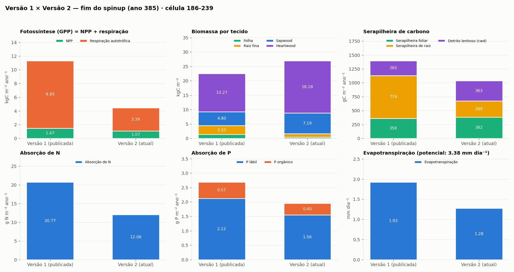
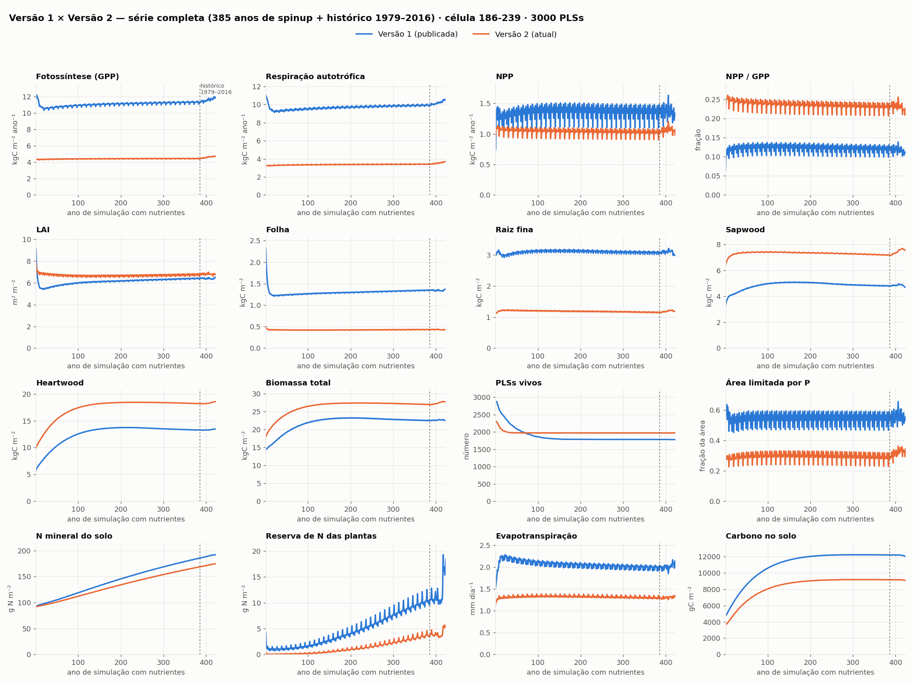

# CAETÊ alométrico com ciclo de nutrientes — célula 186-239: versão 1 × versão 2

Resultados do CAETÊ alométrico (`alloc3.f90`) com o ciclo de N e P ligado, numa
célula da Amazônia central (186-239, 3000 PLSs). Este documento compara a
**versão 1** (a primeira rodada publicada) com a **versão 2**, que corrige o SLA,
a longevidade foliar e a fotossíntese.

## Resumo

- **Carbono.** A fotossíntese (GPP) cai de 11,3 para 4,5 kgC m⁻² ano⁻¹ e a
  respiração autotrófica de 9,9 para 3,4. A NPP muda pouco (1,47 para 1,07) e a
  razão NPP/GPP sobe de 0,13 para 0,24.
- **Folha e raiz.** Folha de 1,35 para 0,44 kgC m⁻² e raiz fina de 3,1 para
  1,2, com o LAI praticamente igual (6,4 e 6,8). O SLA médio passa de 4,8 para
  15,7 m² kgC⁻¹ e a longevidade foliar de 3,8 para 1,1 ano.
- **Lenho.** Cresce de 18,1 para 25,4 kgC m⁻²; a biomassa total vai de 22,5 para
  27,0 kgC m⁻².
- **Estabilidade.** As duas versões estabilizam; a versão 2 chega a 95% da
  biomassa final no ano 74, contra o ano 88 da versão 1.
- **Pontos em aberto.** A evapotranspiração é baixa nas duas versões (1,3 mm
  dia⁻¹ na versão 2, com potencial de 3,4), o N mineral do solo continua
  crescendo, e o lenho ainda está acima do esperado (seção 5).

## 1. O que mudou da versão 1 para a versão 2

| Tema | Versão 1 | Versão 2 | Arquivos |
|---|---|---|---|
| SLA | Do atributo `tleaf` sorteado, pela relação de Reich et al. (1997), sem a conversão para carbono (o SLA ficava cerca de 2 vezes menor) | Do atributo `sla_random`, convertido de massa seca para carbono (fração de 0,47) | `funcs.f90` (`sla_trait`), `productivity.f90`, `budget.f90`, `budget_allom.f90`, `alloc3.f90` |
| Longevidade foliar (alométrica) | Constante de 4 anos para todos os PLSs | 12 / `leaf_long(sla_random)`: longevidade de Sakschewsky et al. (2016) para o SLA de cada PLS | `alloc3.f90` |
| Sorteio do SLA | Uniforme entre 3,5 e 27 mm² mg⁻¹ (mediana ~15) | Log-uniforme entre 3,5 e 27 (mediana ~9,7) | `plsgen.py` |
| Luz da fotossíntese | Luz média de 24 h aplicada o dia todo | Luz média distribuída em 12 h de sol (zero à noite); | `funcs.f90` (`photosynthesis_rate`, `leaf_gross_rate`), `global.f90` |
| Luz das folhas de sol | Irradiância total da camada | Irradiância × coeficiente de extinção do feixe (`p26`), para as folhas de sol não absorverem mais luz do que chega | `funcs.f90` |

## 2. As rodadas

| | |
|---|---|
| Versão do modelo | Alométrica + ciclo de nutrientes (opção `3` em "Which version?") |
| Célula | 186-239 (Amazônia central) |
| PLSs | 3000 |
| Rodada da versão 1 | `ALLOM_NUTRI` |
| Rodada da versão 2 | `ALLOM_NUTRI_V2` |

Sequência executada pelo `model_driver.py`, igual nas duas:

1. **Spinup do solo** (`bdg_spinup`, `sdc_spinup`).
2. **Primeiro spinup**: 55 anos, sem limitação por nutrientes e sem competição por
   luz (não é salvo e não aparece nas figuras).
3. **Segundo spinup**: 385 anos com nutrientes e competição por luz, repetindo o
   clima de 1979–1989 com CO₂ de 1980.
4. **Rodada histórica**: 1979–2016, com clima e CO₂ observados.

Nas figuras, o eixo horizontal é o **ano de simulação com nutrientes**: de 1 a 385
é o segundo spinup e de 386 a 423 é a rodada histórica (linha tracejada). Os
valores são médias ou somas anuais da célula. Cada rodada sorteou a sua própria
tabela de PLSs, então parte das diferenças vem do sorteio; com 3000 PLSs esse
efeito é pequeno.

## 3. Resultados

### 3.1 Comparação numérica

| Variável | V1, ano 385 | V2, ano 385 | Diferença | V1, 2016 | V2, 2016 |
|---|---|---|---|---|---|
| Fotossíntese, GPP (kgC m⁻² ano⁻¹) | 11,3 | 4,45 | −61% | 11,9 | 4,74 |
| Respiração autotrófica (kgC m⁻² ano⁻¹) | 9,85 | 3,39 | −66% | 10,6 | 3,66 |
| NPP (kgC m⁻² ano⁻¹) | 1,47 | 1,07 | −27% | 1,34 | 1,07 |
| NPP / GPP | 0,13 | 0,24 | +85% | 0,11 | 0,23 |
| LAI (m² m⁻²) | 6,42 | 6,84 | +6% | 6,54 | 6,79 |
| SLA efetivo, LAI / folha (m² kgC⁻¹) | 4,76 | 15,7 | +229% | 4,74 | 15,8 |
| Longevidade foliar efetiva (anos) | 3,77 | 1,14 | −70% | 3,93 | 1,14 |
| Folha (kgC m⁻²) | 1,35 | 0,44 | −68% | 1,38 | 0,43 |
| Raiz fina (kgC m⁻²) | 3,10 | 1,16 | −63% | 2,97 | 1,17 |
| Sapwood (kgC m⁻²) | 4,80 | 7,19 | +50% | 4,70 | 7,55 |
| Heartwood (kgC m⁻²) | 13,3 | 18,2 | +37% | 13,5 | 18,6 |
| Biomassa total (kgC m⁻²) | 22,5 | 27,0 | +20% | 22,5 | 27,7 |
| PLSs vivos (de 3000) | 1785 | 1971 | +10% | 1780 | 1971 |
| Serapilheira foliar (gC m⁻² ano⁻¹) | 358 | 382 | +7% | 351 | 377 |
| Carbono no solo (gC m⁻²) | 12 200 | 9170 | −25% | 12 000 | 9090 |
| Evapotranspiração (mm dia⁻¹) | 1,93 | 1,28 | −34% | 2,03 | 1,32 |
| Escoamento (mm dia⁻¹) | 6,81 | 7,45 | +9% | 4,55 | 5,36 |
| N mineral do solo (g m⁻²) | 186 | 169 | −9% | 192 | 175 |
| Reserva de N das plantas (g m⁻²) | 9,55 | 3,39 | −65% | 18,4 | 5,67 |
| Absorção de N (g m⁻² ano⁻¹) | 20,8 | 12,1 | −42% | 18,4 | 12,0 |
| Absorção de P (g m⁻² ano⁻¹) | 2,69 | 1,95 | −27% | 2,59 | 2,00 |
| Área limitada por P | 0,59 | 0,31 | −47% | 0,56 | 0,35 |

O SLA e a longevidade efetivos saem das próprias saídas do modelo (LAI dividido
pela folha, e folha dividida pela serapilheira foliar), para serem comparáveis
entre as versões. A tabela completa está em `comparacao_v1_v2_tabela.csv`.

### 3.2 Fim do spinup



### 3.3 Série completa



### 3.4 Trajetória da versão 2

| Ano | GPP | Respiração | NPP | LAI | Folha | Raiz fina | Sapwood | Heartwood | Biomassa total | PLSs vivos |
|---|---|---|---|---|---|---|---|---|---|---|
| 1 | 4,32 | 3,34 | 0,98 | 7,9 | 0,51 | 1,12 | 6,40 | 9,92 | 18,0 | 2311 |
| 11 | 4,34 | 3,23 | 1,11 | 7,0 | 0,43 | 1,21 | 7,08 | 11,4 | 20,2 | 2128 |
| 55 | 4,39 | 3,30 | 1,09 | 6,8 | 0,43 | 1,22 | 7,39 | 15,6 | 24,6 | 1973 |
| 150 | 4,44 | 3,35 | 1,09 | 6,7 | 0,43 | 1,20 | 7,40 | 18,2 | 27,2 | 1971 |
| 385 | 4,45 | 3,39 | 1,07 | 6,8 | 0,44 | 1,16 | 7,19 | 18,2 | 27,0 | 1971 |
| 423 (2016) | 4,74 | 3,66 | 1,07 | 6,8 | 0,43 | 1,17 | 7,55 | 18,6 | 27,7 | 1971 |

GPP, respiração e biomassa em kgC m⁻² ano⁻¹ ou kgC m⁻². No histórico (1979–2016)
a GPP varia de 4,4 a 4,7 e a NPP de 0,95 a 1,20.

## 4. Leitura dos resultados

**O que a versão 2 muda.**

- **Fotossíntese e respiração caem juntas.** A queda da fotossíntese vem da luz
  distribuída em 12 h (a folha satura ao meio-dia, e a luz média de 24 h
  superestimava a taxa diária) e do CO₂ interno. A queda da respiração vem da
  regra de 5% da madeira. Por isso a NPP, que é a diferença, muda pouco.
- **A folha fica mais fina e de vida mais curta.** O SLA do atributo e a
  longevidade de Sakschewsky amarram as duas propriedades no mesmo PLS. A
  biomassa de folha e de raiz fina cai em dois terços com LAI semelhante.
- **Mais carbono vai para a madeira.** Com a respiração da madeira menor, a biomassa
  do caule passa de 18 para 25 kgC m⁻² e a biomassa total sobe 20%.
- **Menos demanda de nutrientes.** A absorção de N cai 42% e a de P, 27%. A
  área limitada por P cai de 59% para 31%, quase toda pela folha (a raiz fina
  responde por 1% da área); o lenho nunca é limitado e não há limitação por N.
- **A comunidade sobrevive mais** (1971 PLSs contra 1785): o sorteio log-uniforme
  do SLA coloca menos PLSs na faixa de folha muito fina, que é a que mais morre.

**O que as duas versões têm em comum.**

- O ciclo de P fecha: a absorção iguala o retorno pela serapilheira e o P lábil
  do solo fica constante (2,4 g m⁻² na versão 2).
- O carbono do solo estabiliza entre os anos 200 e 250 (98% e 99,9% do valor final).
- A NPP e o LAI são estáveis ao longo do spinup e no histórico.


## 5. Figuras por versão

Cada pasta tem seis figuras para a série completa e as mesmas seis só para o
histórico (1979–2016):

| Figura | Conteúdo |
|---|---|
| `fig1_fluxos_carbono` | GPP, respiração, NPP, eficiência de uso do carbono, LAI |
| `fig2_biomassa` | Biomassa total e por tecido, estoque de carbono não estrutural |
| `fig3_N_P_tecidos` | Razões N:C e P:C e N e P contidos nos tecidos |
| `fig4_comunidade_limitacao` | PLSs vivos, área de lenhosas, limitação por nutriente e por órgão |
| `fig5_ciclo_nutrientes` | Absorção e serapilheira de N e P, N e P no solo, reservas |
| `fig6_respiracao_solo` | Respiração por componente, respiração do solo, serapilheira, carbono no solo |

- Versão 1: [`v1_inicial/`](v1_inicial/)
- Versão 2: [`v2_atual/`](v2_atual/)

Nas figuras 3, as razões N:C e P:C são médias da comunidade ponderadas pela área;
no modelo, são atributos fixos de cada PLS, por isso as curvas variam pouco. O
conteúdo de N e P por tecido é o carbono do tecido vezes essa razão média, uma
aproximação.

## 6. Arquivos e como refazer

| Arquivo | Conteúdo |
|---|---|
| `comparacao_v1_v2_series.png`, `comparacao_v1_v2_barras.png` | Figuras da comparação |
| `comparacao_v1_v2_tabela.csv` | Tabela completa da comparação (anos 385 e 2016) |
| `v1_inicial/anual.csv`, `v2_atual/anual.csv` | Tabela anual de cada rodada, uma linha por ano de simulação |
| `scripts/agrega.py` | Lê as saídas diárias (`spinNN.pkz`) e gera a `anual.csv` |
| `scripts/plota.py` | Gera as figuras de uma rodada a partir da `anual.csv` |
| `scripts/compara.py` | Gera as figuras e a tabela da comparação |

As saídas diárias não estão no repositório (a pasta `outputs/` não é
versionada). Para refazer a partir de uma rodada pelo `model_driver.py`, a partir
de `docs/allom_nutri_gridcell186-239/scripts/`:

```bash
python agrega.py ../../../outputs/<rodada> ../v2_atual gridcell186-239
python plota.py ../v2_atual "CAETÊ alométrico + nutrientes, versão 2"
python compara.py
```

O `agrega.py` considera os 35 primeiros arquivos `spinNN.pkz` como o segundo
spinup e os demais como o histórico, como na configuração atual do
`model_driver.py`. O `compara.py` lê as duas `anual.csv`; para comparar outras
rodadas, troque as pastas dentro do script.
