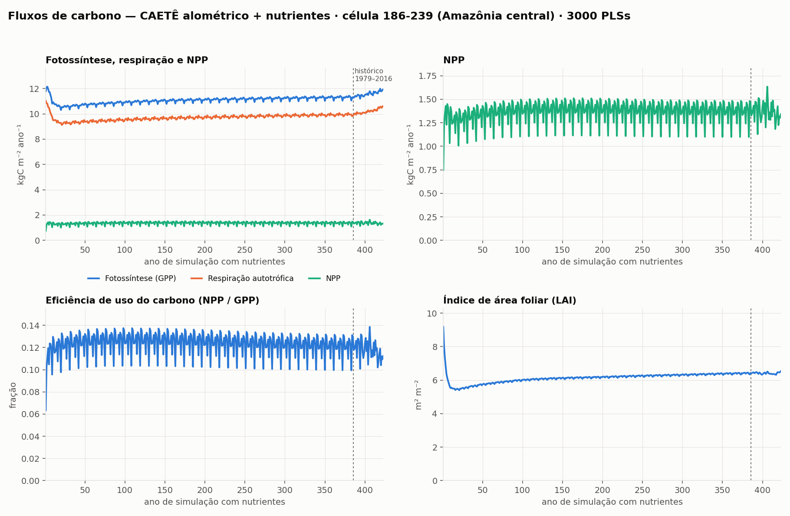
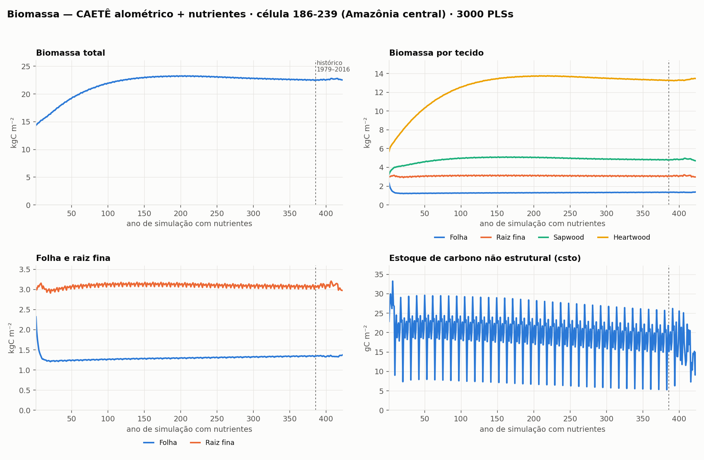
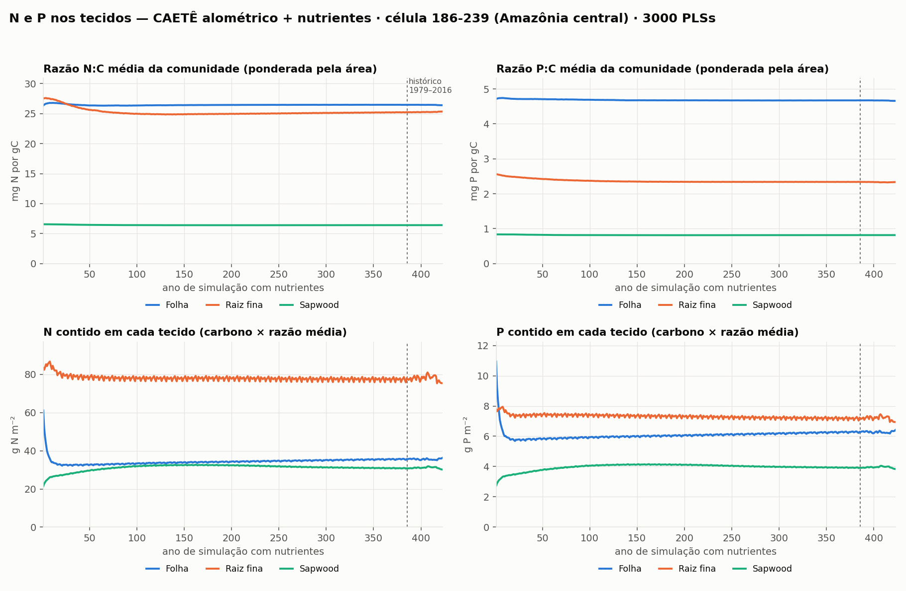
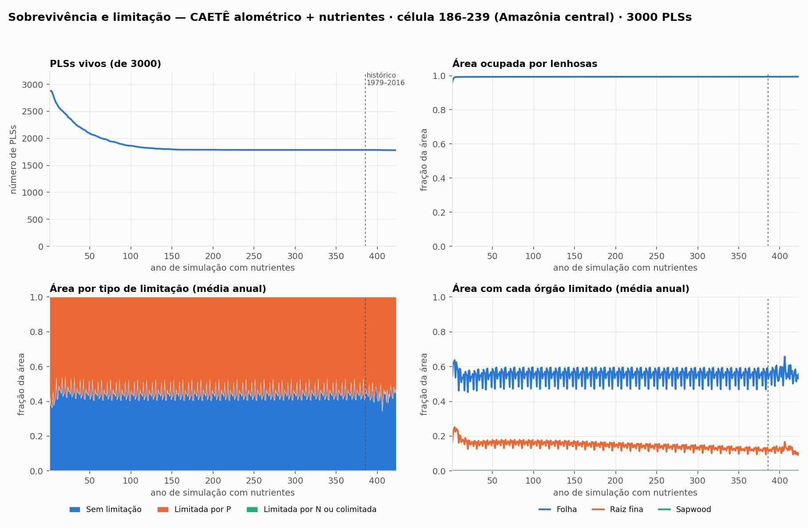
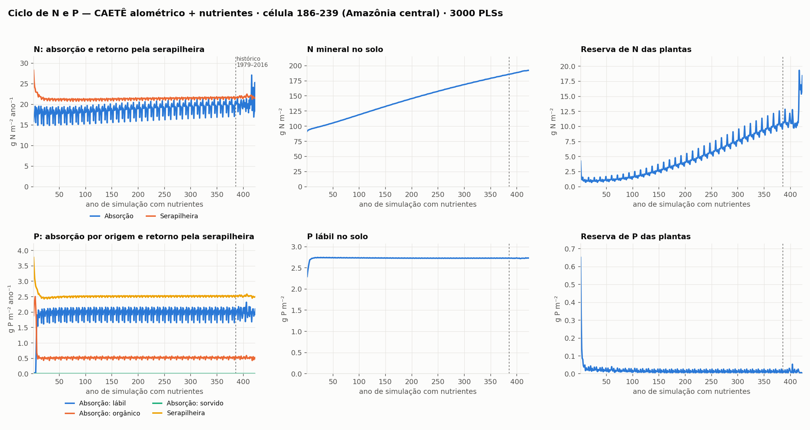
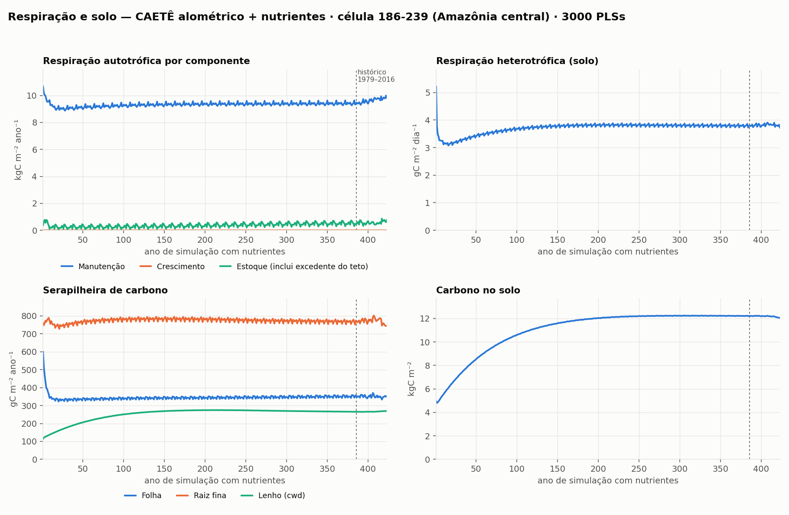

# CAETÊ alométrico com ciclo de nutrientes — rodada de uma célula

Resultados de uma rodada da versão alométrica do CAETÊ (`alloc3.f90`) com o
ciclo de N e P ligado, numa célula da Amazônia central. Serve para avaliar o
comportamento do modelo com o acoplamento de nutrientes: o que já está estável
e o que ainda precisa de correção.

## A rodada

| | |
|---|---|
| Versão | Alométrica + ciclo de nutrientes (opção `3` em "Which version?") |
| Célula | 186-239 (Amazônia central) |
| PLSs | 3000 |
| Código | branch `ba-bia_precision_lightcomp` |

Sequência executada pelo `model_driver.py`:

1. **Spinup do solo** (`bdg_spinup`, `sdc_spinup`).
2. **Primeiro spinup**: 55 anos, sem limitação por nutrientes e sem competição
   por luz. Não é salvo e não aparece nas figuras.
3. **Segundo spinup**: 385 anos com nutrientes e competição por luz, repetindo
   o clima de 1979–1989 com CO₂ de 1980.
4. **Rodada histórica**: 1979–2016, com clima e CO₂ observados.

Nas figuras, o eixo horizontal é o **ano de simulação com nutrientes**: 1 a 385
é o segundo spinup e 386 a 423 é a rodada histórica. A linha tracejada marca o
início do histórico. Todos os valores são médias ou somas anuais da célula.

## Principais resultados

| Variável | Ano 11 | Ano 55 | Ano 385 (fim do spinup) | 2016 |
|---|---|---|---|---|
| Fotossíntese, GPP (kgC m⁻² ano⁻¹) | 10,9 | 10,8 | 11,3 | 11,9 |
| Respiração autotrófica (kgC m⁻² ano⁻¹) | 9,48 | 9,31 | 9,85 | 10,6 |
| NPP (kgC m⁻² ano⁻¹) | 1,38 | 1,44 | 1,47 | 1,34 |
| LAI (m² m⁻²) | 5,6 | 5,8 | 6,4 | 6,5 |
| Folha (kgC m⁻²) | 1,27 | 1,25 | 1,35 | 1,38 |
| Raiz fina (kgC m⁻²) | 3,08 | 3,10 | 3,10 | 2,98 |
| Sapwood (kgC m⁻²) | 4,05 | 4,64 | 4,80 | 4,70 |
| Heartwood (kgC m⁻²) | 7,07 | 10,6 | 13,3 | 13,5 |
| PLSs vivos | 2606 | 2062 | 1785 | 1780 |
| N mineral do solo (g m⁻²) | 96 | 107 | 186 | 192 |
| P lábil do solo (g m⁻²) | 2,72 | 2,74 | 2,73 | 2,73 |
| Reserva de N das plantas (g m⁻²) | 0,75 | 0,85 | 9,6 | 18,4 |

**O que está estável**

- A biomassa total estabiliza em cerca de 22,5 kgC m⁻² por volta do ano 150.
- A NPP (~1,4 kgC m⁻² ano⁻¹) e o LAI (~6) ficam estáveis.
- Os PLSs vivos caem de 2880 para cerca de 1785 e estabilizam.
- O ciclo de P fecha: a absorção iguala o retorno pela serapilheira e o P lábil
  do solo fica constante.
- Em média 55% da área é limitada por P (pela folha, e em parte pela raiz
  fina). Não há limitação por N, e o sapwood nunca é limitado.

**Pontos de atenção (ainda não resolvidos)**

1. **Fotossíntese e respiração altas.** A GPP (11–12 kgC m⁻² ano⁻¹) é cerca de
   três vezes a medida na região (~3), e a respiração autotrófica acompanha. A
   razão NPP/GPP fica em 0,12, contra ~0,3 observado.
2. **Respiração de crescimento praticamente zero** (0,0002 kgC m⁻² ano⁻¹),
   enquanto a de manutenção é ~9,4.
3. **N mineral do solo cresce sem parar**, de 92 para 192 g m⁻², sem sinal de
   equilíbrio.
4. **Reserva de N das plantas cresce** ao longo de toda a rodada e salta nos
   últimos anos do histórico.
5. **Raiz fina e folha altas** em relação ao que se mede em floresta de terra
   firme.

## Figuras

Cada figura existe em duas versões:

- **série completa** (`figN_….png`): os 385 anos do segundo spinup seguidos dos
  38 anos do histórico. O histórico ocupa só a ponta direita do eixo;
- **só a rodada histórica** (`figN_…_historico.png`): os mesmos painéis de 1979
  a 2016, com o ano civil no eixo.

As figuras abaixo são as da série completa; as da rodada histórica estão
ligadas em cada seção.

### 1. Fluxos de carbono

GPP, respiração autotrófica e NPP no mesmo eixo; a NPP sozinha; a eficiência de
uso do carbono (NPP/GPP); e o LAI.



Só a rodada histórica: [fig1_fluxos_carbono_historico.png](fig1_fluxos_carbono_historico.png)

### 2. Biomassa

Biomassa total; por tecido (folha, raiz fina, sapwood, heartwood); folha e raiz
fina em escala própria; e o estoque de carbono não estrutural (`csto`), que
tem um teto de 50 gC m⁻² por PLS.



Só a rodada histórica: [fig2_biomassa_historico.png](fig2_biomassa_historico.png)

### 3. N e P nos tecidos

Em cima, as razões N:C e P:C de folha, raiz fina e sapwood, como média da
comunidade ponderada pela área de cada PLS. Embaixo, o N e o P contidos em cada
tecido.

No modelo, N:C e P:C são atributos fixos de cada PLS. As curvas de cima só
mudam quando a composição da comunidade muda, por isso ficam quase planas. O
conteúdo de N e P (embaixo) é o carbono do tecido vezes a razão média: é uma
aproximação, porque a saída guarda apenas os pools somados da célula.



Só a rodada histórica: [fig3_N_P_tecidos_historico.png](fig3_N_P_tecidos_historico.png)

### 4. Sobrevivência e limitação

Número de PLSs vivos; fração da área ocupada por lenhosas; fração da área por
tipo de limitação (sem limitação, por P, por N ou colimitada); e fração da área
em que cada órgão está limitado. A limitação é a média anual dos valores
diários.



Só a rodada histórica: [fig4_comunidade_limitacao_historico.png](fig4_comunidade_limitacao_historico.png)

### 5. Ciclo de N e P

Linha de cima, nitrogênio: absorção pelas plantas e retorno pela serapilheira;
N mineral do solo; reserva de N das plantas. Linha de baixo, o mesmo para o
fósforo, com a absorção separada por origem (P lábil, orgânico e sorvido).



Só a rodada histórica: [fig5_ciclo_nutrientes_historico.png](fig5_ciclo_nutrientes_historico.png)

### 6. Respiração e solo

Respiração autotrófica por componente (manutenção, crescimento e estoque, que
inclui o carbono respirado acima do teto do `csto`); respiração heterotrófica;
serapilheira de carbono por origem; e carbono no solo.



Só a rodada histórica: [fig6_respiracao_solo_historico.png](fig6_respiracao_solo_historico.png)

## Arquivos desta pasta

| Arquivo | Conteúdo |
|---|---|
| `fig1_…png` a `fig6_…png` | As seis figuras da série completa |
| `fig1_…_historico.png` a `fig6_…_historico.png` | As mesmas figuras só para 1979–2016 |
| `anual.csv` | Tabela com uma linha por ano de simulação e todas as variáveis das figuras |
| `agrega.py` | Lê as saídas diárias da rodada (`spinNN.pkz`) e gera a `anual.csv` |
| `plota.py` | Gera as figuras a partir da `anual.csv` |

Colunas da `anual.csv` e unidades:

- `photo`, `npp`, `ar`, `rm`, `rg`: kgC m⁻² ano⁻¹ (média anual)
- `cleaf`, `cfroot`, `csap`, `cheart`, `csto`: kgC m⁻²
- `lai`: m² m⁻²
- `litter_l`, `litter_fr`, `cwd`, `c_cost`: gC m⁻² ano⁻¹
- `nupt_*`, `pupt_*`, `litter_n`, `litter_p`: g m⁻² ano⁻¹
- `nsto`, `psto`, `nmin`, `pmin`: g m⁻²
- `hresp`: gC m⁻² dia⁻¹; `csoil`: gC m⁻²
- `n2c_*`, `p2c_*`: g g⁻¹ (média ponderada pela área)
- `area_*`: fração da área; `pls_vivos`: número de PLSs
- `fase`: `spinup` ou `historico`

## Como refazer

As saídas diárias não estão no repositório (a pasta `outputs/` não é
versionada). Para refazer as figuras a partir da tabela anual:

```bash
cd docs/allom_nutri_gridcell186-239
python plota.py
```

Para refazer tudo com uma rodada nova:

1. Em `src/`, compilar (`make so`) e rodar `python model_driver.py`, escolhendo
   a versão `3`. As saídas vão para `outputs/<nome da rodada>/`.
2. No `agrega.py`, apontar `RUN` e `CELL` para a rodada e a célula; no
   `plota.py`, ajustar o título em `SUB`.
3. Rodar `python agrega.py` e depois `python plota.py`.

O `agrega.py` considera que os 35 primeiros arquivos `spinNN.pkz` são o
segundo spinup e os demais são o histórico, como na configuração atual do
`model_driver.py`.
