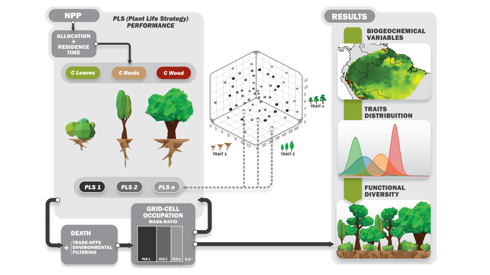

LabTerra - CAETÊ
================

CAETÊ – CArbon and Ecosystem functional-Trait Evaluation model
--------------------------------------------------------------

CAETÊ-DVM is a trait-based Dynamic Vegetation Model developed from the CPTEC Potential Vegetation Model, aimed at simulating ecosystem processes based on variations in plant functional traits. Unlike conventional DGVMs (Dynamic Global Vegetation Models), which categorize vegetation into a few fixed Plant Functional Types (PFTs), CAETÊ allows thousands of distinct ”life strategies”within the same experiment. The primary objective of CAETÊ is to capture vegetation and soil properties more faithfully by representing each Plant Life Strategy (PLS) as a unique volume composed of combinations of various functional traits.

   **CAETÊ Flowchart.**

.. toctree::
   :maxdepth: 2
   :caption: Contents:

   .. modules/modules
   model-structure
   input-data
   setup
   build-and-run
   tutorials